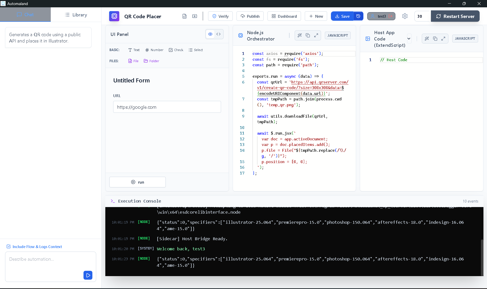
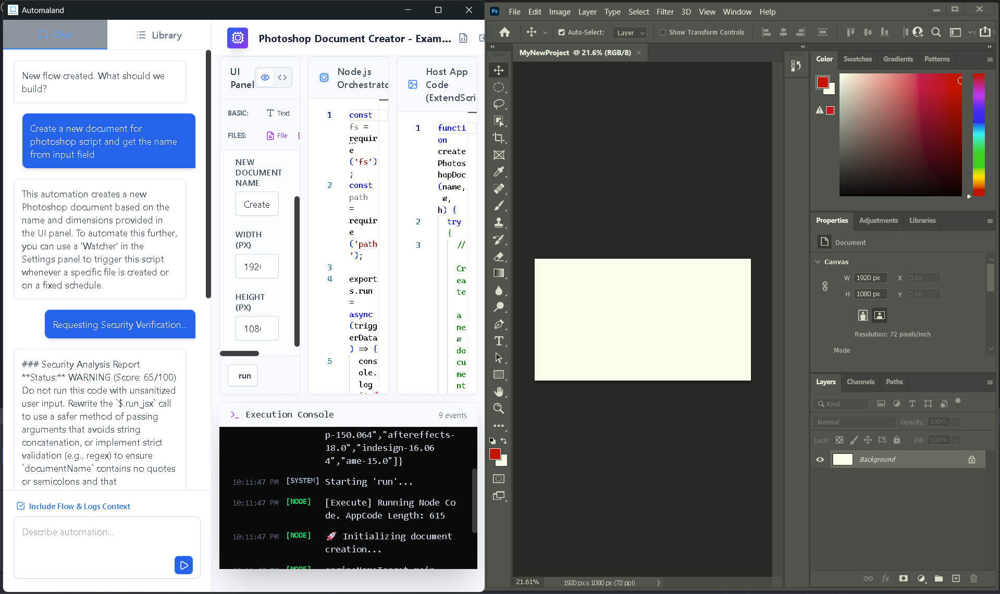

# Automaland

The AI-native automation platform for Creative Professionals. Design, prompt, and orchestrate Host App & Node.js workflows using a unique TriPanel architecture.

**[🌐 Download](https://automaland.com/)**
</br></br></br>



## 🚀 Overview

Automaland replaces complex visual node graphs with a streamlined execution model split into three coupled layers:

1.  **UI Panel**: Dynamic forms generated from JSON Schema (Draft 7).
2.  **Node.js Orchestrator**: The "Brain" handling file systems, APIs, networking, and logic.
3.  **Host App Panel**: The "Hands" executing native ExtendScript (ES3) in Host Apps (Photoshop, Illustrator, InDesign, etc.).

## ✨ Features

*   **AI Architect**: Chat with Gemini, OpenAI, or Claude to generate full automation flows (UI + Logic + App Code) in seconds.
*   **TriPanel Architecture**: Clean separation of concerns for maintainable automation scripts.
*   **Watchers**: Auto-trigger flows based on File System events (hot folders) or Cron schedules.
*   **Hybrid Storage**: Save flows locally (SQLite) or sync to a private cloud (Strapi).
*   **Secure**: Local execution with AES-256 encryption for sensitive environment variables.
*   **Cross-Platform**: Built with Tauri v2 for macOS and Windows.

## 🛠️ Tech Stack

*   **Frontend**: React 19, TailwindCSS, Monaco Editor, Lucide Icons.
*   **Core**: Tauri (Rust) v2.
*   **Sidecar**: Node.js (bundled via `esbuild`/`pkg`) for heavy lifting and Host App communication.
*   **Database**: SQLite (via `rusqlite`) for local flow storage.

## 📦 Installation & Development

### Prerequisites
*   [Node.js](https://nodejs.org/) (v18+)
*   [Rust](https://www.rust-lang.org/tools/install) (Latest Stable)
*   **Windows**: Visual Studio Build Tools with "Desktop development with C++" workload.
*   **macOS**: Xcode Command Line Tools.

### Setup

1.  **Clone the repository**
    ```bash
    git clone https://github.com/Starttoaster/Automaland.git
    cd Automaland
    ```

2.  **Install Frontend Dependencies**
    ```bash
    npm install
    ```

3.  **Install Sidecar Dependencies**
    ```bash
    cd server
    npm install
    cd ..
    ```

### Running in Development Mode

1.  **Build the Sidecar** (Required before running Tauri)
    This bundles the Node.js server and native bridge libraries.
    ```bash
    cd server
    npm run bundle
    cd ..
    ```

2.  **Start the App**
    ```bash
    npm run tauri dev
    ```

### Building for Production

**Windows**
```bash
npm run tauri build
```
Output: `src-tauri/target/release/bundle/msi/`

**macOS**
```bash
npm run tauri build
```
Output: `src-tauri/target/release/bundle/dmg/`

## ❤️ Support the Project

Building Automaland requires hundreds of hours of coding and caffeine. If this tool saves you time in your daily workflow or powers your business, consider fueling the next update! Your support helps cover server costs and keeps the project open-source.

<a href="https://adiljouahri.gumroad.com/l/automaland">
  
</a>

## 🧩 Architecture

### The Sidecar
The Node.js sidecar (`server/`) runs as a background process managed by Tauri. It handles:
*   **File Watching**: Uses `chokidar` for folder triggers.
*   **Execution**: Runs user-defined Node.js code in a VM sandbox.

### Storage
*   **Local**: Flows are stored in `flows.db` (SQLite) within the OS AppData directory.
*   **Cloud (Optional)**: Configure a Strapi URL in Settings to sync flows to a team server.


## ⚠️ Disclaimer
Automaland is an independent software tool. It is not affiliated with, endorsed by, authorized by, sponsored by, or in any way officially connected with the software vendors of the supported host applications or their subsidiaries. The names Photoshop, Illustrator, InDesign, and Premiere Pro are registered trademarks of their respective owners.

